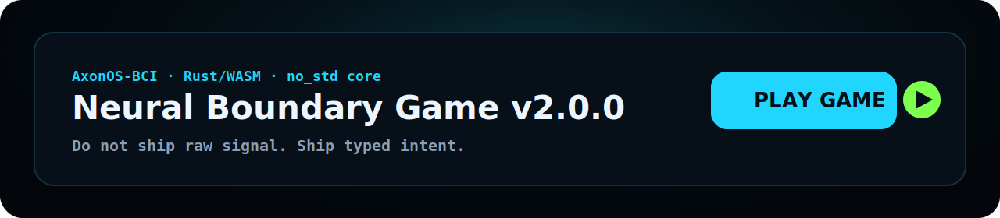

# Neural Boundary Game

<<<<<<< HEAD
**Do not ship raw signal. Ship typed intent.**

[](https://github.com/AxonOS-BCI/neural-boundary-game/actions/workflows/ci.yml)
[](https://github.com/AxonOS-BCI/neural-boundary-game/actions/workflows/pages.yml)
[](LICENSE)
[](crates/neural-boundary-core/src/lib.rs)

[](https://axonos-bci.github.io/neural-boundary-game/)

Playable Rust/WASM demo of the core BCI safety rule: **raw signal stays
inside the device; applications receive typed intent only.**

**Play it now:** <https://axonos-bci.github.io/neural-boundary-game/>

## What this demonstrates

In a BCI-adjacent stack there is one boundary that decides whether the whole
system is reviewable: the line between the signal layer and the application
layer. This repository turns that line into a playfield. Entities stream
toward a membrane across five lanes; you validate intent, gate consent, log
evidence, quarantine hazards — and only then release. Raw frames must never
cross. Unsupported claims move faster than evidence, because they always do.

The game is also a deterministic reference implementation:

- the simulation core is `#![no_std]` Rust with `#![forbid(unsafe_code)]`,
  zero allocation, fixed entity pool, integer math, 60 Hz fixed step;
- every run is reproducible from a seed and an input script;
- shipped replay vectors pin the exact terminal state — down to a 64-bit
  FNV-1a hash of the entire simulation — and CI re-verifies them on every
  push.

Win by sealing the boundary: `TRUST ≥ 90 · RISK ≤ 20 · INTEGRITY ≥ 80 ·
EVIDENCE ≥ L2 · all 5 review gates · 0 raw leaks`. Lose when integrity
collapses, risk overflows, a third raw frame leaks, or a stimulation command
crosses. Full rules: [`docs/GAME_SPEC.md`](docs/GAME_SPEC.md).

## Controls

| Input | Effect |
|---|---|
| `↑ ↓` / `W S` / click a lane | select lane |
| `1` Validate | type an `INTENT`, classify a `?PKT` |
| `2` Convert | validated intent → `TYPED` (needs consent + evidence ≥ L1) |
| `3` Quarantine | contain a hazard or claim |
| `4` Consent | gate a `CONSENT` token (25 s window) |
| `5` Evidence | log `EVIDENCE` / `CHECKSUM` / `CI TEST` |
| `⏎` Release | seal the boundary |
| `P` / `R` / `H` | pause / restart / help |

## Workspace

```text
crates/
  neural-boundary-core   #![no_std] deterministic simulation (game rules, RNG, state hash)
  neural-boundary-cli    replay verifier + vector toolkit (verify / record / search / trace)
  neural-boundary-web    wasm-bindgen front-end: canvas playfield + Foundation Grande stage
vectors/                 pinned replay vectors + sha256 checksums
docs/                    game spec, replay spec, boundary docs, style standard
tools/                   replay validator, claim-hygiene gate, release gate, preview generator
scripts/                 smoke check, Termux push, release tagging
```

## Deterministic replays

Verify the canonical vector against the core:

```bash
cargo run -p neural-boundary-cli --release -- verify
```

```text
Replay OK
Final trust: 92
Final risk: 12
Final integrity: 88
Boundary status: SEALED
```

Both shipped vectors use **seed 58** on standard difficulty — the same world
twice. Played with boundary discipline (38 recorded actions), it ends at tick
1862: trust 92, risk 12, integrity 88, five gates, zero leaks, `SEALED`. Left
idle, the very same seed breaches at tick 948 when the third raw frame
crosses:

```bash
cargo run -p neural-boundary-cli --release -- verify vectors/replay-breach-demo-v2.1.2.json
```

```text
Replay OK
Final trust: 47
Final risk: 0
Final integrity: 58
Boundary status: BREACHED
```

The only difference between `SEALED` and `BREACHED` is what you do at the
membrane. Schema, hash definition and regeneration commands:
[`docs/REPLAY_SPEC.md`](docs/REPLAY_SPEC.md).

## Build and run locally

Prerequisites: stable Rust with the `wasm32-unknown-unknown` target, and
[Trunk](https://trunkrs.dev) for the web stage.

```bash
rustup target add wasm32-unknown-unknown
cargo install trunk

trunk serve --open          # web stage at http://127.0.0.1:8080
cargo test -p neural-boundary-core
cargo test -p neural-boundary-cli
```

Push from Termux (runs every gate, commits, pushes):

```bash
bash scripts/termux_push.sh
# default commit message:
# feat: release Neural Boundary Game v2.1.2 Foundation Grande Edition
```

## Quality gates

`bash scripts/smoke_check.sh` runs exactly what CI runs:

```text
cargo fmt --all --check
cargo test -p neural-boundary-core
cargo test -p neural-boundary-cli
cargo check -p neural-boundary-web
cargo build -p neural-boundary-web --target wasm32-unknown-unknown
python3 tools/validate_replay.py     # vector schema + checksums
python3 tools/check_hygiene.py       # forbidden capability claims
python3 tools/release_check.py       # version consistency + release layout
```

## Repository presentation

About, topics, website, social preview and release steps are documented in
[`docs/GITHUB_SETUP.md`](docs/GITHUB_SETUP.md). The stage's visual tokens are
normative: [`docs/AXONOS_STANDARD_STYLE.md`](docs/AXONOS_STANDARD_STYLE.md).

## Scope and claims

This is an educational technical demo of a software boundary principle. It
does not process real signal data and does not control hardware — the full
list is in [`docs/LIMITATIONS.md`](docs/LIMITATIONS.md), and
[`docs/CLAIM_HYGIENE.md`](docs/CLAIM_HYGIENE.md) is enforced by CI. Boundary
background: [`docs/BCI_BOUNDARY.md`](docs/BCI_BOUNDARY.md),
[`docs/NO_RAW_NEURAL_DATA.md`](docs/NO_RAW_NEURAL_DATA.md).

## Working with the author

Repository review, `no_std` architecture, protocol boundaries, conformance
vectors and reviewer-ready documentation:
[`docs/COMMERCIAL_SERVICES.md`](docs/COMMERCIAL_SERVICES.md) ·
[axonos.org](https://axonos.org) ·
[medium.com/@AxonOS](https://medium.com/@AxonOS) · <connect@axonos.org>

## License

Dual-licensed under [MIT](LICENSE-MIT) or [Apache-2.0](LICENSE-APACHE), at
your option.

---

`v2.1.2 • AxonOS Standard Foundation Grande Style • deterministic Rust core`
=======
[](https://github.com/AxonOS-BCI/neural-boundary-game/actions/workflows/ci.yml)
[](https://axonos-bci.github.io/neural-boundary-game/)
[](https://github.com/AxonOS-BCI/neural-boundary-game/releases/tag/v2.0.0)
[](https://github.com/AxonOS-BCI/neural-boundary-game/tags)


[](https://axonos-bci.github.io/neural-boundary-game/)

[](https://axonos-bci.github.io/neural-boundary-game/)
[](https://github.com/AxonOS-BCI/neural-boundary-game)
[](https://github.com/AxonOS-BCI/neural-boundary-game/releases/tag/v2.0.0)

**Elite AxonOS Standard Foundation Grande Style.**

> **Do not ship raw signal. Ship typed intent.**


## Live demo

```text
https://axonos-bci.github.io/neural-boundary-game/
```

This page is a real playable canvas game. It does not require video playback and does not depend on a missing WASM export to animate the game surface.

If the link returns 404, enable Pages from the committed `/docs` folder:

```bash
bash scripts/enable_pages_docs_source.sh
```

Workflow links:

```text
https://github.com/AxonOS-BCI/neural-boundary-game/actions/workflows/ci.yml
https://github.com/AxonOS-BCI/neural-boundary-game/actions/workflows/pages.yml
```

## What this is

Neural Boundary Game is a deterministic Rust/WASM demo of the core AxonOS BCI boundary rule:

```text
Signal layer    -> raw frames, noise, artifacts
Boundary layer  -> consent, confidence, evidence, checks
App layer       -> typed intent only
```

The project is built from a clean v2.0.0 baseline: no `web-sys`, no `wasm-bindgen`, no `#[no_mangle]`, no browser-binding dependency surface, and no patched legacy glue.

## GitHub About

Description:

```text
Playable Rust/WASM demo of the core BCI safety rule: raw signal stays inside the device; apps receive typed intent only.
```

Website:

```text
https://axonos-bci.github.io/neural-boundary-game/
```

Topics:

```text
rust,wasm,webassembly,no-std,bci,privacy,embedded,deterministic-game,axonos,neurotechnology
```

To apply with GitHub CLI:

```bash
bash scripts/configure_github_about.sh
```

## Architecture

```text
crates/
  neural-boundary-core   no_std deterministic state machine
  neural-boundary-cli    dependency-light replay verifier
  neural-boundary-web    dependency-light WASM boundary adapter

vectors/
  replay-v2.0.0.json
  checksums.txt

docs/
  GitHub setup, API surface, claim hygiene, BCI boundary, release process
```

## v2.0.0 functions

The core exposes reviewer-oriented state helpers:

```text
release_ready()
boundary_status()
review_summary()
apply_script(actions)
risk_budget_remaining()
evidence_gap()
nbg_review_flags_after_demo_path()
nbg_release_blockers_after_demo_path()
```

These helpers make the demo more useful as a deterministic protocol/review artifact, not only as a visual canvas.

## Gameplay

This release turns the demo page from a static canvas frame into a playable browser game:

```text
moving packets
keyboard controls
mobile touch controls
release blocked / victory states
trust, risk, integrity and evidence loops
```

## Controls

```text
W / ArrowUp       move up
S / ArrowDown     move down
1 / Space         validate
2                 convert
3                 quarantine
4                 consent gate
5                 evidence gate
Enter             release
```

Click or touch the bottom action bar on mobile.

## Run locally

```bash
rustup target add wasm32-unknown-unknown
bash scripts/smoke_check.sh
```

Manual checks:

```bash
cargo fmt --all
cargo test -p neural-boundary-core
cargo test -p neural-boundary-cli
cargo test -p neural-boundary-web
cargo check -p neural-boundary-web
cargo build -p neural-boundary-web --target wasm32-unknown-unknown --release
python3 tools/validate_replay.py
python3 tools/check_hygiene.py
python3 tools/release_check.py
python3 tools/check_links.py
```

## Clean signed release push

This rewrites the remote `main` history. Use only when intentionally replacing the previous history with clean v2.0.0:

```bash
I_UNDERSTAND_REWRITE_HISTORY=YES bash scripts/force_clean_push_signed.sh
```

## Commercial services

See [`docs/COMMERCIAL_SERVICES.md`](docs/COMMERCIAL_SERVICES.md).

Contact: **connect@axonos.org**

## Limitations

This is an educational technical demo. It does not process real signal data and does not control stimulation hardware.

See [`docs/LIMITATIONS.md`](docs/LIMITATIONS.md).

## License

Licensed under MIT.
>>>>>>> origin/main
